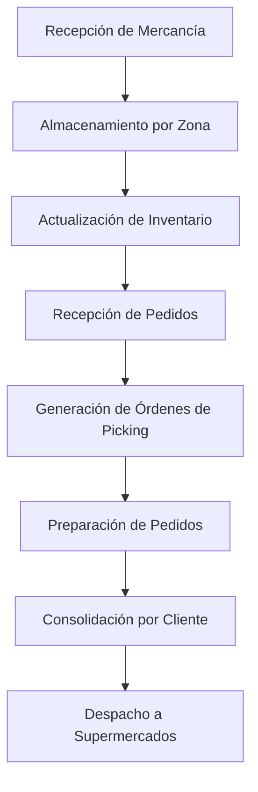

# 🏬 Centro de Distribución Medellín - OpenWMS Demo

**Colombian Supermarket Distribution Center Simulation**  
*Simulación de Centro de Distribución de Supermercados Colombianos*

---

## 🇨🇴 ¿Qué Simula Este Sistema? | What Does This System Simulate?

Este demo presenta un **centro de distribución realista** que abastece a las principales cadenas de supermercados en Medellín y área metropolitana, manejando productos de consumo masivo típicos del mercado colombiano.

*This demo presents a **realistic distribution center** that supplies major supermarket chains in Medellín and the metropolitan area, handling typical Colombian mass consumption products.*

## 🏪 Cadenas de Supermercados | Supermarket Chains

| Cliente | Ubicación | Tipo de Productos |
|---------|-----------|-------------------|
| **Almacenes Éxito** | Centro Medellín | Productos premium y marca propia |
| **Olímpica** | El Poblado | Diversidad de marcas nacionales |
| **Carulla** | Laureles | Productos gourmet y premium |
| **Tienda D1** | Bello | Productos básicos y económicos |
| **Jumbo** | Envigado | Compras al por mayor |

## 📦 Categorías de Productos | Product Categories

### 🌾 ALMACÉN SECO | Dry Goods Storage
- **Arroz Diana Extra 5kg** - Molinos Roa S.A.
- **Aceite Gourmet 1L** - Team Foods  
- **Pasta Doria Espagueti 500g** - Grupo Nutresa
- **Azúcar Manuelita 2kg** - Manuelita S.A.

### ❄️ REFRIGERADOS | Refrigerated Products
- **Yogurt Alpina Griego 150g** - Alpina Productos Alimenticios
- **Queso Colanta Campesino 500g** - Cooperativa Colanta
- **Jamón Zenú Premium 250g** - Grupo Nutresa

### 🧊 CONGELADOS | Frozen Products
- **Pollo Campollo Entero** - Campollo
- **Helado Popsy Vainilla 1L** - Meals de Colombia

### 🧽 PRODUCTOS DE LIMPIEZA | Cleaning Products
- **Detergente Ariel 2kg** - Procter & Gamble
- **Suavizante Suavitel 1.8L** - Colgate-Palmolive
- **Jabón Rey Azul 300g** - Unilever

### 🧴 CUIDADO PERSONAL | Personal Care
- **Colgate Total 150ml** - Colgate-Palmolive
- **Shampoo Head & Shoulders 375ml** - Procter & Gamble
- **Jabón Protex Antibacterial 110g** - Colgate-Palmolive

## 🏗️ Estructura del Almacén | Warehouse Layout

```
📍 ÁREAS DE ALMACENAMIENTO | STORAGE AREAS:

🚪 RECIBO (REC-001 a REC-004)
   └── Área de recepción de mercancía

🌾 ALMACÉN SECO (SEC-A01-01 a SEC-B01-02)  
   ├── Pasillo A01: Arroz, aceites, pastas
   ├── Pasillo A02: Azúcar, condimentos
   └── Pasillo B01: Enlatados, conservas

❄️ REFRIGERADOS (REF-C01-01 a REF-C02-02)
   ├── Cámara C01: Lácteos (2-8°C)
   └── Cámara C02: Embutidos (0-4°C)

🧊 CONGELADOS (CONG-D01-01 a CONG-D02-01)
   ├── Cámara D01: Cárnicos (-18°C)
   └── Cámara D02: Helados (-22°C)

🧽 LIMPIEZA (LIM-E01-01 a LIM-E02-01)
   └── Productos químicos y limpieza

🧴 CUIDADO PERSONAL (CP-F01-01 a CP-F02-01)
   └── Higiene y cuidado personal

📦 PICKING (PICK-01 a PICK-04)
   └── Estaciones de preparación de pedidos

🚛 DESPACHO (DESP-01 a DESP-04)
   └── Muelles de carga y despacho
```

## 🚀 Getting Started | Comenzar

### 1. Iniciar el Sistema | Start the System
```bash
# Navigate to the demo directory
cd zile-demo

# Start all services
docker compose up -d

# Wait for services to start (2-3 minutes)
sleep 180
```

### 2. Cargar Datos Demo | Load Demo Data
```bash
# Run the Colombian supermarket demo
./medellin-supermarket-demo.sh

# Or load basic data
./load-demo-data.sh
```

### 3. Verificar Servicios | Verify Services
```bash
# Check service status
docker compose ps

# Check registered services
curl -s http://localhost:8762/eureka/apps | grep -o '<name>[^<]*</name>'
```

## 🌐 Interfaces Web | Web Interfaces

| Servicio | URL | Credenciales | Propósito |
|----------|-----|--------------|-----------|
| **Eureka Dashboard** | http://localhost:8762 | Ninguna | Registro de servicios |
| **RabbitMQ Management** | http://localhost:15672 | guest/guest | Monitor de mensajes |
| **Jaeger Tracing** | http://localhost:16686 | Ninguna | Trazabilidad distribuida |

## 🔧 APIs Disponibles | Available APIs

### Common Service (Puerto 8120)
```bash
# Obtener ubicaciones del almacén
curl -X GET http://localhost:8120/v1/locations

# Obtener unidades de transporte (estibas con productos)
curl -X GET http://localhost:8120/v1/transport-units

# Obtener grupos de ubicaciones por categoría
curl -X GET http://localhost:8120/v1/location-groups
```

### TMS Service (Puerto 8131)  
```bash
# Obtener órdenes de transporte
curl -X GET http://localhost:8131/v1/transport-orders

# Crear nueva orden para Éxito
curl -X POST http://localhost:8131/v1/transport-orders \
  -H 'Content-Type: application/json' \
  -d '{
    "transportOrderNumber": "TO-EXITO-001",
    "sourceLocation": "SEC-A01-01", 
    "targetLocation": "PICK-01",
    "barcode": "PAL-7701234567890",
    "priority": 80
  }'
```

### Routing Service (Puerto 8130)
```bash
# Obtener rutas activas
curl -X GET http://localhost:8130/v1/routes

# Verificar estado del motor de workflows
curl -X GET http://localhost:8130/actuator/health
```

## 📊 Operaciones Típicas | Typical Operations

### 🌅 Operación Matutina | Morning Operations
1. **Recepción de Mercancía** - Camiones llegan con productos frescos
2. **Almacenamiento** - Productos se ubican en zonas según temperatura
3. **Inventario** - Actualización de stocks en tiempo real

### 🏪 Procesamiento de Pedidos | Order Processing
1. **Éxito Medellín** - Pedido de 500 unidades variadas
2. **Olímpica El Poblado** - Productos premium y refrigerados  
3. **D1 Bello** - Productos básicos en volumen
4. **Carulla Laureles** - Mix de categorías gourmet

### 🚛 Despacho | Shipping
1. **Preparación** - Picking automatizado por zona
2. **Consolidación** - Armado de pedidos por cliente
3. **Carga** - Asignación de muelles y camiones
4. **Despacho** - Salida con documentación completa

## 🔄 Flujo de Trabajo | Workflow



## 📈 Métricas y Monitoreo | Metrics & Monitoring

### KPIs Principales | Key Performance Indicators
- **Accuracy de Picking**: >99.5%
- **Tiempo de Ciclo**: <2 horas pedido completo
- **Utilización de Espacio**: 85-95%
- **Rotación de Inventario**: 12x por año
- **On-Time Delivery**: >98%

### Monitoreo en Tiempo Real | Real-time Monitoring
```bash
# Monitor RabbitMQ queues
curl -u guest:guest http://localhost:15672/api/queues

# View service health
curl http://localhost:8120/actuator/health
curl http://localhost:8131/actuator/health

# Check distributed traces
# Open http://localhost:16686 in browser
```

## 🛠️ Troubleshooting

### Problemas Comunes | Common Issues

| Problema | Solución |
|----------|----------|
| Servicios no responden | Esperar 2-3 minutos para inicio completo |
| APIs retornan 404 | Verificar registro en Eureka dashboard |
| tcp-palettconv reiniciando | Normal - problema de compatibilidad de plataforma |
| Conexión RabbitMQ falla | Asegurar que RabbitMQ esté completamente iniciado |

### Comandos de Diagnóstico | Diagnostic Commands
```bash
# Ver logs de todos los servicios
docker compose logs -f

# Ver logs de servicio específico
docker compose logs -f common-service

# Reiniciar servicios
docker compose restart

# Verificar puertos
netstat -tulpn | grep -E "(8120|8131|8762|15672)"
```

## 🏁 Stopping the System | Detener el Sistema

```bash
# Stop all containers
docker compose down

# Remove volumes (optional - removes all data)
docker compose down -v

# Remove images (optional)
docker system prune -a
```

## 🌟 Business Value | Valor Comercial

### Capacidades del Sistema | System Capabilities
- **SKUs Soportados**: 10,000+ productos diferentes
- **Transacciones/día**: 50,000+ movimientos
- **Clientes**: 100+ supermercados en la región
- **Zonas de Temperatura**: 4 diferentes (-22°C a ambiente)
- **Integración**: ERP, POS, WMS, TMS

### ROI Esperado | Expected ROI
- **Reducción de Errores**: 75% menos errores de picking
- **Optimización de Espacio**: 30% mejor utilización
- **Tiempo de Ciclo**: 50% reducción en preparación
- **Costos Operativos**: 25% reducción en mano de obra
- **Satisfacción Cliente**: 98% cumplimiento de entregas

---

## 🎯 ¡Perfecto para Colombia! | Perfect for Colombia!

Este sistema está diseñado específicamente para el mercado colombiano:

✅ **Marcas Locales** - Alpina, Diana, Zenú, Colanta  
✅ **Cadenas Nacionales** - Éxito, Olímpica, Carulla, D1  
✅ **Normativas Locales** - INVIMA, códigos de barras colombianos  
✅ **Geografía** - Optimizado para Medellín y área metropolitana  
✅ **Clima Tropical** - Manejo especial de productos refrigerados  

**¡Una solución WMS verdaderamente colombiana!** 🇨🇴 